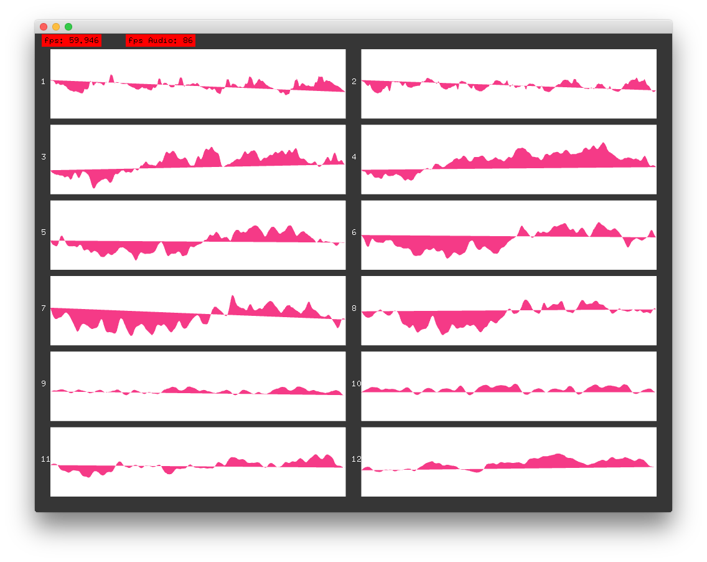
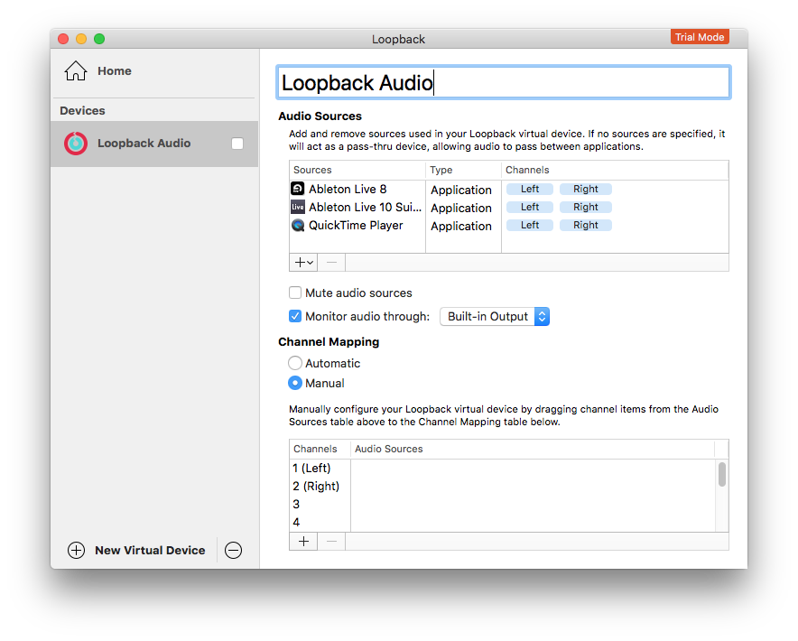

A recurring need at [fuse*](http://www.fuseworks.it/) is the need to have a great iteration between audio and video. The starting point is to have the possibility to have the audio signal inside the generative software (usually written in [OpenFrameworks](http://openframeworks.cc/).

For this reason we have studied the several possibility to have audio rewire for OF
environment available for Mac OS and Windows 10.

First we created an base OF example to read multi input audio channels.

### MultiAudioInExample

MultiAudioInExample is an extension of _audioInputExample_ (included in OF workspace) with the possibility to see more than 2 input audio channels.



You can setup the number of input channel and the buffer size changed the const variables declared in _ofApp.h_
```c++
const int numChannels = 12;
const int bufferSize = 512;
```
and the other params of [ofSoundStream](http://openframeworks.cc/documentation/sound/ofSoundStream/)
```c++
soundStream.setup(this, 0, numChannels, 44100, bufferSize, 4);
```

ofSoundStream, after setup, called the method _audioIn_ using [ofSoundBuffer](http://openframeworks.cc/documentation/sound/ofSoundBuffer/)
```c++
void ofApp::audioIn(ofSoundBuffer &inBuffer)
```

alternatively you alternatively you can use the float buffer directly (now is commented). **In my experience it's more boring but it solved me an annoying vector error in Window 10 using audiojack.**
```c++
void ofApp::audioIn(float * input, int bufferSize, int nChannels)
```

#Audio rewire

Software compatibility is something very frustrating. For this reason we divided software for compatibility, usually we work on MacBook Pro and our clients use windows machine.
So ... from the bottom of my heart I apologise to linux users (which I admire every day) but I took into consideration only Mac OS and Windows.

Some other compatibility is available, but in this post we will only consider the combinations that we have personally tested.


### Mac OS
**Loopback**

[Loopback](https://rogueamoeba.com/loopback/) is the best ready to go software for Mac OS, the natural successor of [SoundFlower](https://rogueamoeba.com/freebies/soundflower/).



Pros | Cons
------------ | -------------
Easy to use and very easy configuration | It's not free, you need to buy the [licence](https://rogueamoeba.com/loopback/buy.php)
Continuous updates | It's not open source
Autostart | Available only for Mac OS
Unlimited virtual channels (tested 12x channels) | Static routing audio (you cannot select each application)


We use Loopback for our interactive show [Dökk](http://fuseworks.it/en/project/dokk-en/) and we are very satisfied: you need just select Loopback as audio device and create virtual channels.

**SoundFlower**

We used often [SoundFlower](https://github.com/RogueAmoeba/Soundflower-Original) in the past, but now we use only Loopback. So i can't explain if is still available for the last Mac OS, but seeing the github repository is not update from several years.


### Windows

**Jack Audio**

[JACK Audio](http://jackaudio.org/) is _"a professional sound server daemon that provides real-time, low-latency connections for both audio and MIDI data between applications that implement its API"_.

IMMAGINE


Pros | Cons
------------ | -------------
Free | Not ready to go, but there is a useful [FAQ](http://jackaudio.org/faq/jack_on_windows.html) for Windows
Open source | It doesn't work with all audio software [[1]()] [[2]()]
Unlimited virtual channels (tested 12x channels) |
Very flexible routing audio for each application |


[1] _JACK (in windows) works with PortAudio driver so audio application have to use that driver. In my experience JACK with [ASIO4ALL](http://www.asio4all.org/), the sound was generated using [Ableton Live 10](https://www.ableton.com/en/live/)._

[2] _In Live 10 select Driver Type: ASIO4ALL, Audio Output Device: JackRouter._


##### JACK with OpenFrameworks

I tested with success OF 0.9.8 in a Windows 10 machine using Visual Studio 2015. After started the OF app, you can see the name of application in the _Jack Audio Connection Kit_ and you can connect (using mouse dragging) the Output to the Input. You can create [persistent connection](http://jackaudio.org/faq/persistent_connections.html) using [PatchBay](http://www.rncbc.org/drupal/node/76).


IMMAGINE


**Dante Via**

After numerous researches i finally found an alternative to Loopback for Windows, this is [Danta Via](https://www.audinate.com/products/software/dante-via).


IMMAGINE

Pros | Cons
------------ | -------------
Easy to use and very easy configuration | It's not free, you need to buy the [licence](https://www.audinate.com/products/software/dante-via#getvia)
Avaible for Windows and Mac OS | It's not open source
Very flexible route audio for each application| Limited to 16x16 channels
Possibility to route sound over network [[3]()]  |


[3] _Very interesting, but I did not have the chance to test it._


#### Audio Over network

An interesting research is send audio samples buffer over network. We tried through OSC messages between Max MSP and OpenFrameworks, but we met several problem. If you have some suggestion or ideas are welcome!
